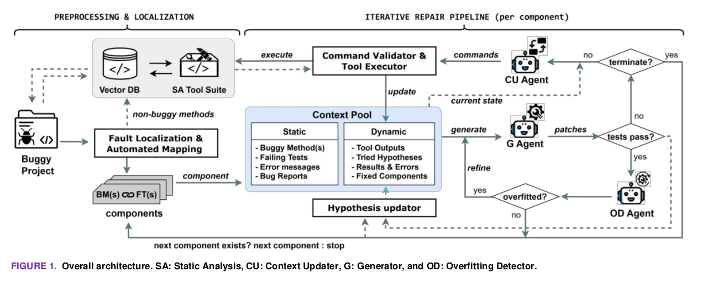

# Agent-Based Automated Program Repair with Dynamic Context and Static Analysis


This repository contains the source code and experimental results for our agent-based automated program repair framework. The system orchestrates three specialized LLM agents — **Context Updater (CU)**, **Generator (G)**, and **Overfitting Detector (OD)** — with six static analysis tools and a dynamic context pool to iteratively repair software bugs.

### Key Results (Defects4J v1.2 + v2.0, 660 bugs)

| Model | Defects4J v1.2 | Defects4J v2.0 | Total |
|-------|---------------|---------------|-------|
| **GPT-4o** | 187 | 178 | **365** |
| **QwenCoder-32B** | 131.3 ± 3.1 | 120.7 ± 2.1 | **252** |
| **CodeLlama-34B** | 60.7 ± 3.5 | 47.3 ± 4.0 | **108** |

(Open-source model results: mean ± std across 3 independent runs)

---

## Architecture

<p align="center">
  
</p>

**SA**: Static Analysis &nbsp;|&nbsp; **CU**: Context Updater &nbsp;|&nbsp; **G**: Generator &nbsp;|&nbsp; **OD**: Overfitting Detector

- **Iteration 1**: G operates on static context only (buggy code + tests + errors).
- **Iteration 2+**: CU analyzes failures → selects tools → retrieves context → G creates patches.
- **On test pass**: OD validates semantic correctness → if overfitting detected, triggers G refinement.

---

## Agents and Prompt Templates

Complete prompt templates for all three agents are documented in [`docs/PROMPT_TEMPLATES.md`](docs/PROMPT_TEMPLATES.md).

| Agent | Source File | Role |
|-------|-----------|------|
| **Generator (G)** | `src/agents/generator_agents.py` | Generates n=10 diverse patch candidates per iteration with explicit hypotheses |
| **Context Updater (CU)** | `src/agents/llm_context_manager.py` | Analyzes failed patches, selects static analysis tools, retrieves relevant context |
| **Overfitting Detector (OD)** | `src/controller.py` | Validates test-passing patches for semantic correctness, triggers refinement |

### Static Analysis Tools

| Tool | ID | Description |
|------|----|-------------|
| Coverage Runner | τ₁ | Runs coverage to determine BM–FT mapping |
| Similar Method Search | τ₂ | FAISS + CodeBERT similarity search |
| Code Extractor | τ₃ | Extracts methods, classes, fields, tests |
| Call Graph Builder | τ₄ | Builds caller/callee relationships |
| Field Dependency Analyzer | τ₅ | Tracks field usage and dependencies |
| API Usage Finder | τ₆ | Finds API usage examples in the project |

---

## Model Configurations

### GPT-4o (Closed-Source)

| Parameter | Context Updater | Generator | Overfitting Detector |
|-----------|----------------|-----------|---------------------|
| **Model** | `gpt-4o` | `gpt-4o` | `gpt-4o` |
| **Temperature** | 0.2 | 1.0 | 0.1 |
| **n** (completions) | 1 | 10 | 1 |
| **response_format** | `json_object` | `json_object` | `json_object` |
| **API** | OpenAI API | OpenAI API | OpenAI API |

### QwenCoder-32B (Open-Source)

| Parameter | Context Updater | Generator | Overfitting Detector |
|-----------|----------------|-----------|---------------------|
| **Model** | `Qwen/QwenCoder-32B-Instruct` | `Qwen/QwenCoder-32B-Instruct` | `Qwen/QwenCoder-32B-Instruct` |
| **Temperature** | 0.2 | 1.0 | 0.1 |
| **n** (completions) | 1 | 10 | 1 |
| **response_format** | `json_schema` (via vLLM proxy) | `json_schema` (via vLLM proxy) | `json_schema` (via vLLM proxy) |
| **max_tokens** | — | 800 (single) / 1500 (multi) | 600 |
| **Deployment** | vLLM on 2× A6000 GPUs | vLLM on 2× A6000 GPUs | vLLM on 2× A6000 GPUs |

### CodeLlama-34B-Instruct (Open-Source)

| Parameter | Context Updater | Generator | Overfitting Detector |
|-----------|----------------|-----------|---------------------|
| **Model** | `codellama/CodeLlama-34b-Instruct-hf` | `codellama/CodeLlama-34b-Instruct-hf` | `codellama/CodeLlama-34b-Instruct-hf` |
| **Temperature** | 0.2 | 1.0 | 0.1 |
| **n** (completions) | 1 | 10 | 1 |
| **response_format** | `json_schema` (via vLLM proxy) | `json_schema` (via vLLM proxy) | `json_schema` (via vLLM proxy) |
| **max_tokens** | — | 800 (single) / 1500 (multi) | 600 |
| **Deployment** | vLLM on 2× A6000 GPUs | vLLM on 2× A6000 GPUs | vLLM on 2× A6000 GPUs |

### Open-Source Model Serving Architecture

Open-source models are served via a local proxy (`server.py`) with the following architecture:

```
Client (port 8000) → FastAPI Proxy → vLLM (port 8001)
```

The proxy provides:
- **JSON schema enforcement**: Forces structured output matching patch response schemas
- **Response coercion**: Post-processes type mismatches and malformed JSON
- **Timeout retry**: Retries slow vLLM calls (max 3 retries, 30-min timeout)

**vLLM Server Parameters:**
```
--tensor-parallel-size 2      # 2× A6000 GPUs
--dtype bfloat16
--gpu-memory-utilization 0.95
--max-model-len 16384
--enable-prefix-caching        # Cache system prompt KV across requests
--enable-chunked-prefill       # Better GPU utilization for mixed prompt lengths
```

### Shared Hyperparameters (All Models)

| Parameter | Value |
|-----------|-------|
| Max iterations per bug | 5 |
| Candidates per iteration (n) | 10 |
| Max hypothesis pool size | 10 |
| Knowledge base token limit | 10,000 |
| Max refinement attempts | 1 |
| Patch deduplication | By normalized whitespace |
| Early stopping | Enabled |

---

## Usage

### Repair

```bash
# Single bug
python main.py --mode repair --bug-id Chart-1

# All 660 Defects4J bugs
python main.py --mode repair --workers 4

# Specific bugs from a file
python main.py --mode repair --bug-list bugs.txt --workers 4

# Preprocess (build vector databases)
python main.py --mode preprocess --benchmark defects4j
```

### Open-Source Models

To run with CodeLlama-34B or QwenCoder-32B instead of GPT-4o:

1. Start vLLM + proxy: `python server.py` (edit `MODEL` in `server.py` for QwenCoder)
2. In the source files below, uncomment the local proxy client (`base_url="http://localhost:8000/v1"`) and comment out the default OpenAI client:
   - `src/agents/generator_agents.py` (~L311, ~L378)
   - `src/agents/llm_context_manager.py` (~L163)
   - `src/controller.py` (~L133)

### Configuration

`configs/default.yaml` — all values can be overridden via CLI arguments:

```yaml
max_iterations: 5                    # Max repair iterations per bug
max_hypothesis_pool_size: 10         # Hypothesis pool capacity
knowledge_base_token_limit: 10000    # Token budget for context
fl_tool: "perfect"                   # "perfect" or "gzoltar"
llm_model: "gpt-4o"                 # LLM model name
temperature: 1                       # Generator temperature
enable_smart_resolution: true        # Smart tool input resolution
enable_caching: true                 # Cache tool results
early_stopping: true                 # Stop on no progress
```

CLI example:
```bash
python main.py --mode repair --bug-id Chart-1 \
    --fl-mode perfect --max-iterations 5 --workers 4 \
    --output-dir results --config configs/default.yaml
```

---

## Experimental Results

Patch result JSONs are included in `results_gpt4o/` and `results_open_source/`. See [`docs/RESULTS.md`](docs/RESULTS.md) for detailed analysis.

### Correct Patch Evaluation

Human-readable evaluation of all semantically correct patches is provided in [`correct_patches/`](correct_patches/), organized by model and experiment. Each entry shows the buggy method, correct patch, and a short semantic equivalence decision against the ground-truth developer patch.

> **Note:** Execution traces (~1.5 GB), vector databases, and Defects4J checkouts are excluded from this repository due to size. They are generated automatically during preprocessing and repair.


---

## Acknowledgments

This work was supported by the National Research Foundation of Korea (NRF) grant funded by the Korea government (MSIT) (NO.2020R1A2B5B01002467 and NO. RS-2022-NR068754).

## License

This project is for research purposes. Please see the paper for detailed methodology and experimental analysis.
